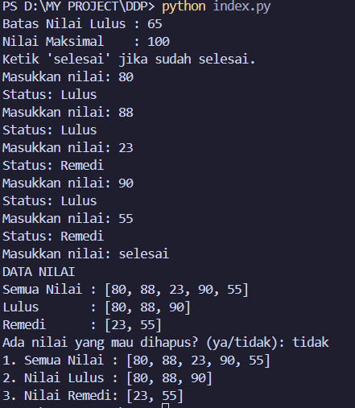

# Program Pengelompokan Nilai Mahasiswa

Program sederhana berbasis Python untuk menginput, memvalidasi, mengelompokkan nilai mahasiswa ke dalam kategori **Lulus** dan **Remedi**, serta menyediakan fitur untuk menghapus nilai jika terjadi kesalahan input.

---

## Penjelasan Kode Program

Program ini dibuat menggunakan bahasa pemrograman Python dengan alur kerja sebagai berikut:

1. **Inisialisasi Variabel**:
   - `batas_nilai`: Tuple berisi batas kelulusan (65) dan nilai maksimal (100).
   - `nilai_masuk`: List untuk menampung seluruh nilai yang dimasukkan.
   - `lulus`: List untuk menampung nilai yang $\ge 65$.
   - `remedi`: List untuk menampung nilai yang $< 65$.
   - `jumlah_nilai`: Variabel counter untuk menghitung jumlah nilai yang sudah diinput.

2. **Perulangan Input Nilai (`while True`)**:
   - Pengguna memasukkan nilai mahasiswa satu per satu.
   - Nilai divalidasi agar berada pada rentang **0 - 100**.
   - Setiap nilai langsung dikategorikan:
     - Jika $\ge 65$ $\rightarrow$ masuk ke list `lulus` dengan status "Lulus".
     - Jika $< 65$ $\rightarrow$ masuk ke list `remedi` dengan status "Remedi".
   - Jika pengguna mengetik `'selesai'`, program akan memeriksa:
     - Apakah jumlah data minimal sudah mencapai **5 nilai**.
     - Apakah sudah terdapat minimal **satu nilai lulus** dan **satu nilai remedi**.
     - Jika syarat terpenuhi, perulangan input berhenti (`break`).

3. **Menampilkan Data Nilai**:
   - Menampilkan ringkasan semua nilai, daftar nilai lulus, dan daftar nilai remedi.

4. **Fitur Hapus Nilai**:
   - Memberikan opsi kepada pengguna jika ingin menghapus nilai yang salah input.
   - Jika nilai ditemukan di dalam list, nilai tersebut akan dihapus dari `nilai_masuk` serta dari list kategori (`lulus`/`remedi`), dan `jumlah_nilai` dikurangi 1.

5. **Hasil Akhir**:
   - Menampilkan hasil akhir dari list `nilai_masuk`, `lulus`, dan `remedi`.

---

## Screenshot / Output Program

### Output di Terminal

```text
Batas Nilai Lulus : 65
Nilai Maksimal    : 100
Ketik 'selesai' jika sudah selesai.
Masukkan nilai: 80
Status: Lulus
Masukkan nilai: 88
Status: Lulus
Masukkan nilai: 23
Status: Remedi
Masukkan nilai: 90
Status: Lulus
Masukkan nilai: 55
Status: Remedi
Masukkan nilai: selesai
DATA NILAI
Semua Nilai : [80, 88, 23, 90, 55]
Lulus       : [80, 88, 90]
Remedi      : [23, 55]
Ada nilai yang mau dihapus? (ya/tidak): ya
Daftar nilai: [80, 88, 23, 90, 55]
Masukkan nilai yang mau dihapus (atau ketik 'selesai'): 55
Nilai 55 berhasil dihapus.
Mau hapus nilai lain? (ya/tidak): tidak
1. Semua Nilai : [80, 88, 23, 90]
2. Nilai Lulus : [80, 88, 90]
3. Nilai Remedi: [23]
```

### Screenshot Hasil Eksekusi


